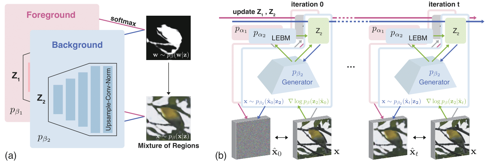

Unsupervised Foreground Extraction via Deep Region Competition


[[Paper](TBD)] [[Code](https://github.com/yuPeiyu98/DRC)]

The official code repository for NeurIPS 2021 paper "Unsupervised Foreground Extraction via Deep Region Competition".

## Installation

The implementation depends on the following commonly used packages, all of which can be installed via conda.

| Package       | Version                          |
| ------------- | -------------------------------- |
| PyTorch       | ≥ 1.8.1                          |
| numpy         | *not specified* (we used 1.20.0) |
| opencv-python | 4.5.1.48                         |
| pandas        | 1.2.3                            |


## Datasets and Pretrained Models

Datasets and pretrained models are available at: https://drive.google.com/drive/folders/1qItekRJcOYBIcVi4ChrcyzwFVl-lrw23?usp=sharing

Please follow the following commands to obtain the `CLEVR6` dataset:

```bash
# Download `clevr_with_masks_train.tfrecords` from deepmind gcloud
cd drc_workspace/scripts
wget https://storage.googleapis.com/multi-object-datasets/clevr_with_masks/clevr_with_masks_train.tfrecords
python load_clevr_with_masks.py
```
This will save the generated dataset in the `meta` folder.

## Training

```bash
# Train a foreground extractor with specified checkpoint folder
python main.py --checkpoints <TO_BE_SPECIFIED>
```

You may specify the value of arguments during training. Please find the available arguments in the `config.yml.example` file in `drc_workspace` folder. Note that `config.yml.example` file provides the training parameters on full `CUB` dataset. Parameters on other datasets and data splits can be found in the `drc_workspace/config_gallery` folder.

Note that `DATA` indicates the dataset to use (`CUB`, `DOG`, `CAR`, `CLEVR` and `TEXTURED`). The path to your dataset folder, i.e., `ROOT_DIR`, needs to be specified before running the script.

## Testing

```bash
# Evaluate the extractor
python test.py --checkpoints <TO_BE_SPECIFIED>
```

## Citation

```
@inproceedings{yu2021unsupervised,
  author = {Yu, Peiyu and Xie, Sirui and Ma, Xiaojian and Zhu, Yixin and Wu, Ying Nian and Zhu, Song-Chun},
  title = {Unsupervised Foreground Extraction via Deep Region Competition},
  booktitle = {Proceedings of Advances in Neural Information Processing Systems (NeurIPS)},
  month = {December},
  year = {2021}
}
```
